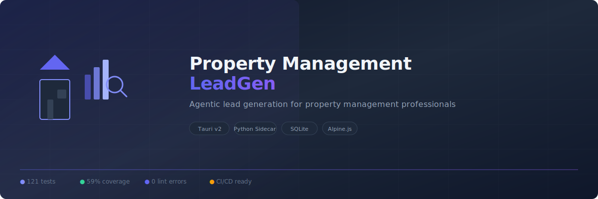

<p align="center">
  
</p>

<p align="center">
  <b>Automated lead generation for property management professionals</b>
  <br/>
  Targeting <b>Orange County, CA</b> and surrounding areas (Los Angeles County)
</p>

<p align="center">
  <a href="https://github.com/iknowkungfubar/property-management-leadgen/actions/workflows/ci.yml"></a>
  <a href="https://github.com/iknowkungfubar/property-management-leadgen/actions/workflows/codeql.yml"></a>
  <a href="#"></a>
  <a href="#"></a>
  <a href="#"></a>
  <a href="#"></a>
  <a href="#"></a>
</p>

---

## Overview

Property Management LeadGen is a **zero-dependency desktop application** that automates the entire lead generation pipeline for small property management firms. Built with a Tauri v2 desktop shell and a Python sidecar backend.

### Key Features

- **CSV Import** — Parse property owner data from title company reports and MLS exports
- **Entity Unmasking** — Automatically look up LLC owners via CA Secretary of State records
- **Market Intelligence** — Vacancy risk scoring, rental yield analysis, competitor sentiment
- **DNC Compliance** — Do-Not-Call filtering before any lead export
- **Priority Scoring** — Algorithmic lead ranking (L_score formula)
- **CAPTCHA Handling** — Headless browser with manual override modal

---

## Architecture

```
┌─────────────────────────────────────────────────────┐
│                  Tauri v2 (Rust)                    │
│  ┌───────────┐   IPC (stdin/stdout JSON)           │
│  │  WebView  │◄──────────────────────────► Python  │
│  │  (Vite +  │      sidecar (src/main.py)          │
│  │  Tailwind │                                     │
│  │  Alpine)  │    ┌─────────────────┐              │
│  └───────────┘    │ Agents:         │              │
│  Frontend         │  Discovery      │              │
│                   │  EntityUnmask   │              │
│                   │  MarketIntell   │              │
│                   │  OutputSynth    │              │
│                   │                 │              │
│                   │ Scrapers:       │              │
│                   │  CA SOS Parser  │              │
│                   │  County ArcGIS  │              │
│                   │  Rental List    │              │
│                   │                 │              │
│                   │ DB: SQLite WAL  │              │
│                   │ LLM: Poly-prov  │              │
│                   └─────────────────┘              │
└─────────────────────────────────────────────────────┘
```

### Core Agents

| Agent | Responsibility |
|-------|---------------|
| **Discovery Agent** | CSV import (Orange Coast Title, CRMLS), address normalisation, APN lookup via county assessor ArcGIS endpoints, absentee-owner flagging |
| **Entity Unmasking Agent** | CA Secretary of State entity search (bizfileOnline), Statement of Information PDF parsing via LLM, principal extraction |
| **Market Intelligence Agent** | FRBO/Craigslist vacancy detection, code enforcement portal scraping, lead priority scoring (L_score formula) |
| **Output Synthesis Agent** | DNC compliance filtering, deduplication, CRM export (CSV / JSON / HubSpot format) |

### Lead Priority Score

```text
L_score = α · R_vac + β · (M_target - M_current) − γ · S_comp
```

Where α=0.4, β=0.4, γ=0.2 by default (configurable).

### LLM Layer

The LLM provider is **polymorphic** — choose your backend in Settings:

| Provider | Backend |
|----------|---------|
| **Anthropic** | `claude-sonnet-4-20250514` via Messages API |
| **OpenAI** | `gpt-4o` via /chat/completions |
| **OpenPipe** | Fine-tuned models via OpenAI-compatible API |
| **Local Ollama** | Local models via /chat/completions |

All providers enforce structured JSON output through a common `LLMProvider` abstract base.

---

## Quick Start

### Prerequisites

- **Python** 3.11+
- **Node.js** 20+
- **Rust** 1.77+ (for Tauri)
- `cargo install tauri-cli`

### Setup

```bash
# 1. Python dependencies
pip install -r requirements.txt

# 2. Node dependencies
cd frontend && npm install && cd ..

# 3. Install Playwright browsers
python -m playwright install chromium

# 4. Run in dev mode
cargo tauri dev
```

### Verify Installation

```bash
# Test the sidecar starts and responds
echo '{"method":"ping"}' | uv run python -m src.main

# Run the full test suite
uv run pytest tests/ -v

# Check lint
uv run ruff check src/ tests/
```

---

## Testing

| Suite | Tests | What it covers |
|-------|-------|---------------|
| `test_main.py` | 26 unit tests | IPC dispatch, error codes, watchdog lifecycle |
| `test_ipc_integration.py` | 14 integration tests | Sidecar subprocess stdin/stdout protocol |
| `test_db.py` | Schema, migrations, connection lifecycle | |
| `test_agents.py` | Discovery, market intelligence, output synthesis | |
| `test_llm.py` | LLM provider factory, Anthropic/OpenAI providers | |
| `test_scrapers.py` | CA SoS parser, rate limiter, rental listings | |
| `test_captcha.py` | CAPTCHA detection, session save/restore | |
| `test_compliance.py` | Phone normalization, DNC stub behavior | |

**Total: 121 tests, 59% coverage, 0 lint errors, Rust compiles clean.**

---

## Project Structure

```
property-management-leadgen/
├── src-tauri/           # Tauri Rust shell
│   ├── Cargo.toml
│   ├── tauri.conf.json
│   └── src/main.rs
├── src/                  # Python sidecar package
│   ├── main.py           # Entrypoint — stdin JSON loop
│   ├── agents/           # 4 core pipeline agents
│   ├── db/               # SQLite schema, migrations, connection
│   ├── llm/              # LLM provider abstraction
│   ├── scrapers/         # Web scrapers (CA SoS, assessor, rentals)
│   ├── captcha/          # CAPTCHA detection & modal handling
│   ├── compliance/       # DNC compliance
│   └── utils/            # Rate limiter, CSV import utilities
├── frontend/             # Tauri webview UI (Vite + Alpine.js + Tailwind)
├── tests/                # 121 pytest tests
├── assets/               # Repository assets (banner, etc.)
├── .github/              # CI workflows, Dependabot config
├── pyproject.toml
├── .pre-commit-config.yaml
├── SECURITY.md
└── README.md
```

---

## Engineering Standards

- **Type hints** on all Python function signatures
- **pydantic** models for structured data
- **Ruff** linting (custom rule set, zero errors)
- **Pre-commit hooks**: ruff lint + format, trailing whitespace, YAML validation, private key detection
- **CI pipeline**: 4 jobs (lint, test, security/cargo-audit, Rust check)
- **Error taxonomy**: 6 error codes distinguishing auth/validation/notfound/internal/rate-limit issues
- **Exponential backoff** with jitter for all scrapers
- **Graceful degradation** — if one agent fails, log and continue
- **Sidecar zombie prevention** — parent PID watchdog auto-exits
- **CAPTCHA state recovery** without credential exposure
- **DNC registry check** before any lead export
- **API key masking** in all IPC responses
- **Path traversal protection** for file imports
- **Credential encryption**: secrets encrypted at rest via Tauri safe-storage (planned)

---

## Security

See [SECURITY.md](SECURITY.md) for the vulnerability disclosure policy.

Dependency scanning is automated via Dependabot (pip, cargo, npm) and CI (pip-audit + bandit SAST).

---

## License

MIT — see [LICENSE](LICENSE) for details.
